# CzCommits

## 1. Installation
Use Commitizen for structured commit messages.  
This guide installs the packages globally.    
Run the following commands in sequence. 

```node
npm install commitizen -g
npm install -g cz-conventional-changelog
echo '{ "path": "cz-conventional-changelog" }' >> ~/.czrc
```
Invalid charset , expects utf-8 issue ? **[Fix your Encoding Issues here.](#fix-encoding-issues)**

## 2. Using Commitizen for Structured Commits

Once the package is installed make some changes in the project and add those changes using `git add .`.   

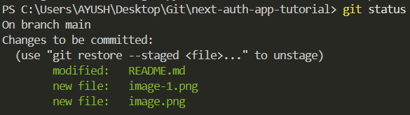

Commit these new changes by  running the following command : 

```
git cz 
```

You should be prompted with some questions about type and scope of the change, bug fix or a new feature.  
*Move up or down using key to reveal more options*.   

**Prompt 1 :** **`Select the type of change you're committing:`**  
    This is a **required** field where you need to select the nature of the commit.  
    The available options determine whether the commit is about a feature, fixes a bug, improves performance, or modifies documentation.


<details>
        <summary><strong> Available Commit Types and Usecases</strong></summary>     

|   Type       |   Usecase |   Example |
|--------------|----------------|-------------------|
| **feat**     | Commits that introduces a new feature. | **`feat: Add Next-Auth for login`** |
| **fix**      | Commits that fixes a bug. | **`fix: Resolve type issues`** |
| **docs**     | Commits that updates the documentation or adds comments. | **`docs: Add Next-Auth documentation`** |
| **style**    | Commits that fornat the code.(whitespace, missing semicolons, etc.) | **`style: Remove unnecessary spaces`** |
| **refactor** | Commits the code restructuring without changing behavior. | **`refactor: Create separate module for helper functions`** |
| **perf**     | Commits that  enhances performance. | **`perf: Optimize queries with Redis`** |
| **test**     | Commits that adds or corrects tests. | **`test: Add unit tests for authentication`** |
| **build**    | Commits that modifies build system or dependencies. | **`build: Upgrade Next.js to latest version`** |
| **ci**       | Commits that updates CI configuration files or scripts. | **`ci: Update GitHub Actions workflow`** |
| **chore**    | Commits that changes that don't affect source or test files. | **`chore: Update package.json dependencies`** |
| **revert** | Commits that reverts a previous commit. | **`revert: Undo last authentication change`** |
---

</details>


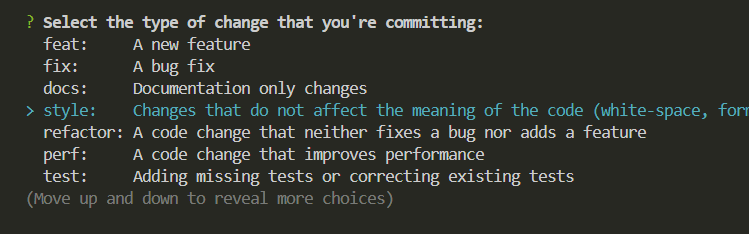

**Prommpt 2 :** **`What is the scope of this change (e.g. component or file name):`**   
    
This **optional** field helps to tell the part of the project that gets affected by the change.  
`Example` : Assume you changed the documentation then you can add **`Readme`** as scope. 

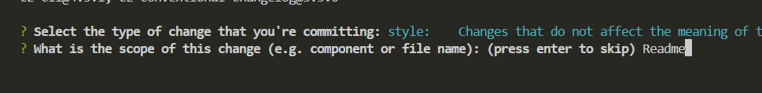

:::tip When to specify scope of changes
If the changes are specific to file or feature you should use scope. It can directly signifies the files affected. Example when modifying docs , add readme in scope. 

If changes affects multiples areas , changes are too broad or maybe they are minor fix, skipping this field is a better option. Example, skip when refactored the helper function into a seperate folder since it could affect multiple files across the directories and components.
:::


**Prompt 3 :** **` Write a short, imperative tense description of the change (max 94 chars): `**

This is a **required** field where users provide a concise description of the commit in **imperative tense** (as if you are giving a command).

**Examples**:  
- **`perf: Optimize caching with Redis`**  
- **`fix(auth): Resolve login issue`**  
- **`docs(readme): Update setup instructions`**  


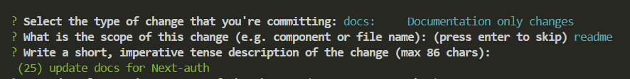


**Prompt 4 :** **` Provide a longer description of the change: (press enter to skip)`**

This is the **optional** field, where you can give any technical explaination about the changes commited.   

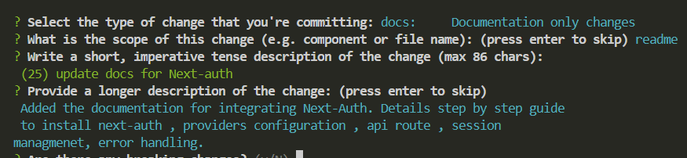


**Prompt 5 :** **`Breaking changes and Open issues`**

If this commit introduces changes that would break existing functionality like API changes or removed features, you would say Yes.  
If this commit is linked to a GitHub issue like a bug fix or feature request, you would need reference the issue here.    

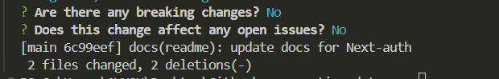


Here all done and dusted.


<a id="fix-encoding-issues"></a>
## 3. Fix Encoding Issues

**In case of error of invalid charset you need to change the file encoding to expected type.**

:::danger invalid charset 
```> git cz```  
The config file at `"C:\Users\YOURNAME\.czrc"` contains an invalid charset. Expected UTF-8.
:::

#### **Step 1** :  Open the `.czrc` file in VSCode 

Either `Ctrl + click` on the file path `C:\Users\YOURNAME\.czrc` displayed on the terminal or find that file in home directory of your user and open in VSCode.   

`.czrc file`   
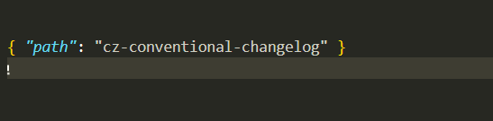


#### **Step 2** : Change File encoding.

a . Press `Ctrl + Shift + P` and type `Change file encoding`.  
b.  Select `Reopen with Encoding`.   
c. Select the appropriate format, in our case it was `utf-8`.   


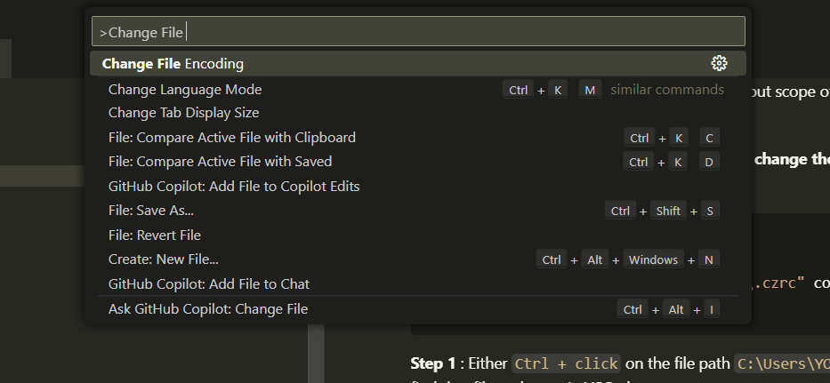


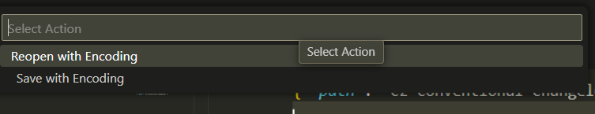


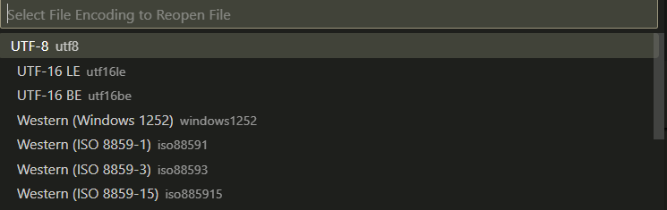

d.  Paste the data provided in the `.czrc` file. 

```json
{ "path": "cz-conventional-changelog" }
```

#### **Step 3** : Run Commitizen 

```
git cz
```

Expected behavior

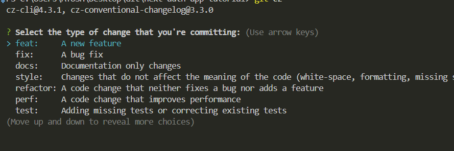


All set!  