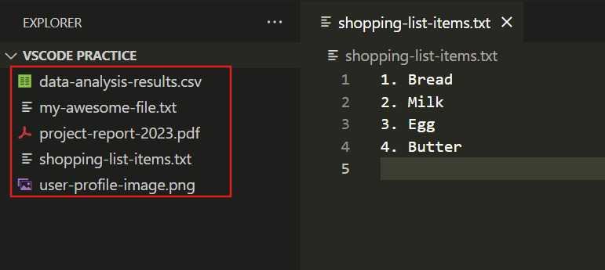
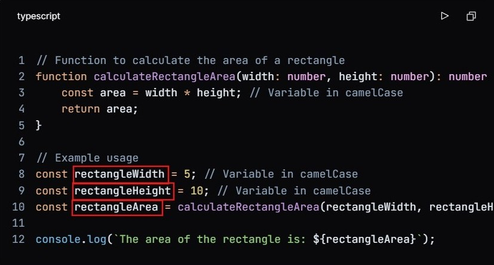

Welcome to our documentation! Here, you'll find important guidelines and best practices to ensure a smooth and successful experience while working on this project.

---

## ✅ Must Follow Guidelines

### 📂 File Naming Convention

- Use **kebab-case** for file names.
- In kebab case, words are separated by hyphens, and all letters are in lowercase.
- Example: `admin-login-form.tsx`

### 📝 Variable Naming Convention

- Use **camelCase** for variable names.
- In camel case, the first word is in lowercase, and each subsequent word starts with an uppercase letter, without spaces or underscores.
- Example: `const userName = "John Doe";`

### 🚀 Function Usage
- **Do not use arrow functions** for defining functions.
- Only use them for **inline functions**. Ex:
  ```tsx
  <form onSubmit={() => {}}> </form>
  ```

### ⚡ `useEffect` Restriction
While `useEffect` is a powerful hook for managing side effects, it can lead to unnecessary complexity, performance issues, and bugs if misused. Here are key reasons to use it judiciously:
**Reference**: [YouTube Link](https://www.youtube.com/watch?v=bGzanfKVFeU)

- **State Update Loops**:  
  Updating state within `useEffect` can trigger re-renders and cause cascading effect executions, potentially leading to infinite loops if dependencies aren't carefully managed.

- **Complexity for Data Transformations**:  
  `useEffect` isn't suited for synchronous tasks like updating derived state (e.g., recalculating cart totals). These should be handled directly in event handlers or utility functions instead.

- **Dependency Array Risks**:  
  Missing dependencies can result in stale data, while overly broad dependency arrays can cause unnecessary effect runs. Managing them correctly is error-prone in complex components.

- **Double Execution in Strict Mode**:  
  In React's Strict Mode (development), `useEffect` runs twice to help detect unclean side effects, which can confuse developers if not understood properly.


### 🔗 API Calls
- **Use TanStack Query** for API requests.
- ❌ Do not use `fetch` or `axios`. Always prefer TanStack Query.

### 🤖 AI Usage Restriction
- ❌ **Do not use AI-generated code.** Write everything manually for better control and quality.

### 🎨 UI Components
- Use **ShadCN components** for UI elements.
- **Do not** create custom components unless absolutely necessary.

### 🎨 Styling
- Use **Tailwind CSS** for styling.

### 🔄 Git Branching Strategy
We follow a structured branch naming convention:
1. `feature/your-feature-name` – For new features.
2. `fix/your-fix-name` – For bug fixes.
3. `refactor/your-refactor-name` – For code refactoring.
4. `hotfix/your-hotfix-name` – For critical fixes when something is breaking in production (**top priority**).

### 📝 Git Commit Messages
- Use **CZ Commitizen** for commit messages.

---

## 📌 Next.js 101
- Refer to the official **[Next.js Documentation](https://nextjs.org/docs)** for detailed information.

---

### 🚧 Limitations of React
- **SEO Issues** – Since React's client-side rendering sends minimal initial HTML, search engines may not see the content, leading to poor SEO..
- **Waterfall Problem** – React components often fetch data in a nested manner, where one request depends on another. This leads to multiple sequential API calls, increasing load time and slowing down performance.

### 🌍 Why is SEO Challenging in React?
React (with client-side rendering) sends minimal initial HTML:

```html
<!DOCTYPE html>
<html>
  <head>
    <title>My React App</title>
  </head>
  <body>
    <div id="root"></div>
    <script src="bundle.js"></script>
  </body>
</html>
```

The `<div id="root"></div>` is empty until JavaScript runs. Search engines may not see content, leading to poor SEO.

## Why is This a Problem?
Search engines rank pages based on content. If content is loaded via JavaScript after the page loads, crawlers may miss it, impacting SEO rankings.

## How to Fix It
Ensure search engines can see content without executing JavaScript. Solutions:

### 1. Server-Side Rendering (SSR)
Server generates full HTML before sending it to the browser.

**Example (Next.js SSR):**
```javascript
export async function getServerSideProps() {
  const res = await fetch('https://api.example.com/data');
  const data = await res.json();
  return { props: { data } };
}

export default function Page({ data }) {
  return (
    <div>
      <h1>{data.title}</h1>
      <p>{data.description}</p>
    </div>
  );
}
```

### 2. Static Site Generation (SSG)
HTML is generated at build time for better SEO.

**Example (Next.js SSG):**
```javascript
export async function getStaticProps() {
  const res = await fetch('https://api.example.com/data');
  const data = await res.json();
  return { props: { data } };
}

export default function Page({ data }) {
  return (
    <div>
      <h1>{data.title}</h1>
      <p>{data.description}</p>
    </div>
  );
}
```

### 3. Pre-Rendering
Generate static HTML files at build time using tools like React Snapshot or React Static.

### 4. Using a Headless CMS
Fetch and render content on the server or via SSG, making it visible to search engines.

### 5. Meta Tags & Structured Data
Include proper meta tags and structured data.

**Example (Next.js Meta Tags):**
```javascript
import Head from 'next/head';

export default function Home() {
  return (
    <div>
      <Head>
        <title>My Page Title</title>
        <meta name="description" content="This is a description of my page." />
      </Head>
      <h1>Welcome to My Page</h1>
    </div>
  );
}
```

## Conclusion
React's client-side rendering can cause SEO issues due to empty initial HTML. Using SSR, SSG, pre-rendering, or proper meta tags ensures better search engine visibility and rankings.


### ⚡ Next.js Overview
- Next.js is a **framework** built on top of React that makes building websites easier and faster. It helps improve SEO and performance by allowing pages to load quickly with features like **server-side rendering (SSR)** and **static site generation (SSG)**. It also has built-in tools for handling images, routing, and fetching data, making development smoother and more efficient.

### 📌 Routing in Next.js


- Previously, Next.js used Pages Routing with the /pages directory. Later it introduced **App Routing** in version 13+, using the **`/app` directory** for a more flexible and powerful routing system. 

#### 📌 **Basic Routing**  
In the `app/` directory, each folder represents a route, and the `page.tsx` file inside defines the page content.  
- `app/page.tsx` → `/` (Home Page)  
- `app/about/page.tsx` → `/about`  

### 📌 Catch-All Segments
- Catch-all segments let you create one dynamic route that can handle multiple URL parts. This is useful when you don’t know how many segments a URL might have.  

# 🔗 How It Works  
- Use `[...slug]` inside the `app/` directory to capture **one or more** URL segments.  

# ✅ Example  
If you create this file:  
```bash  
app/blog/[...slug]/page.tsx  
```
It can match different URLs like:  
- `/blog/post-1` → `["post-1"]`  
- `/blog/category/post-2` → `["category", "post-2"]`   


#### 📌 **Dynamic Routing**  
Use square brackets `[ ]` to create dynamic routes.  
- `app/product/[id]/page.tsx` → Accessible as `/product/1`, `/product/2`, etc.  

#### 📌 **Nested Layouts & Shared UI**  
Layouts help structure pages efficiently.  
- `app/layout.tsx` applies a layout to all pages inside `app/`.  
- `app/dashboard/layout.tsx` → A layout specific to `/dashboard/*` pages.  

#### 📌 **API Routes in App Router**  
Instead of `pages/api/`, APIs are now created using `route.tsx` files.  
- `app/api/user/route.tsx` → Accessible at `/api/user`.  

#### 📌 **Loading & Error Handling**  
- `loading.tsx` → Shows a loading state while the page loads.  
- `error.tsx` → Handles page-specific errors gracefully.  

### 📂 Route Groups
Route Groups in Next.js help organize your project’s folder structure without affecting the URL. They are created by wrapping a folder name in parentheses ( ).
- Reference: [Next.js Documentation](https://nextjs.org/docs/app/building-your-application/routing/route-groups)


- Helps manage large projects with multiple sections (e.g., admin vs. public).
- Example: `app/(admin)/dashboard/page.tsx` does not include `(admin)` in the URL.


### ⚡ Next.js 15 and `await` in Parameters
- In Next.js 15, route handlers support **`await` in parameters**, simplifying data fetching.
- Example:
  ```tsx
  export default async function Page({ params }: { params: { id: string } }) {
    const data = await fetchData(params.id);
    return <div>{data.title}</div>;
  }
  ```


